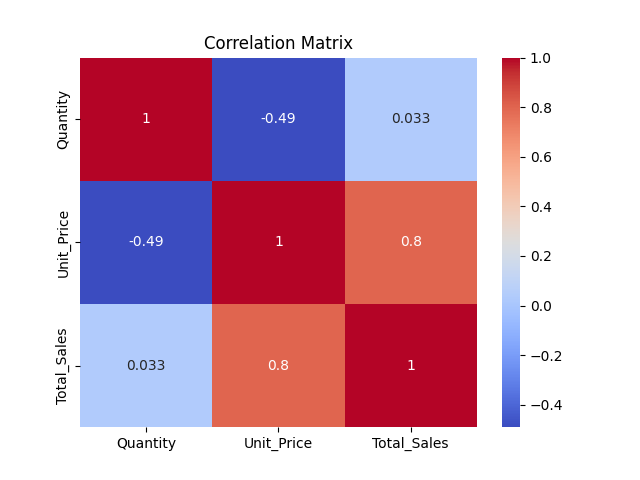

# 🏪 Supermarket Branch Sales Analysis using Python

This project analyzes supermarket branch performance using **Python**, **Pandas**, **Seaborn**, and **Matplotlib**.
It includes branch-wise sales trends, product category performance, customer type analysis, and correlation heatmap.


## 🧠 Project Objectives

* Analyze **Total Sales per Branch**
* Compare **Product Category performance**
* Study **Customer Type spending**
* Explore correlation between numeric features (Quantity, Unit Price, Total Sales)


## 🗂️ Project Structure


📂 Supermarket-Branch-Sales-Analysis
 
 ┣ 📜 main.py
 
 ┣ 📊 total_sales_branch.png
 
 ┣ 📊 sales_by_category.png
 
 ┣ 📊 sales_by_customer_type.png
 
 ┣ 📊 correlation_matrix.png
 
 ┗ 📘 README.md


## 🧩 Libraries Used

| Library    | Purpose               |
| ---------- | --------------------- |
| pandas     | Data handling         |
| seaborn    | Advanced plots        |
| matplotlib | Visualization control |

Install them using:

```bash
pip install pandas seaborn matplotlib
```


## 📈 Visualizations

### 🏬 **1. Total Sales per Branch**


### 🛍️ **2. Average Sales by Product Category**


### 👥 **3. Sales by Customer Type**


### 🔥 **4. Correlation Heatmap**




## 🚀 How to Run

1. Clone the repo


git clone https://github.com/ishalangehh-wq/Supermarket-Branch-Sales-Analysis.git
```

2. Run the Python script


python main.py


3. All charts will be saved automatically in PNG format.


## 💡 Key Insights

* Branch A shows consistently higher sales
* Food category generates the most sales
* Members spend slightly more than Normal customers
* Strong correlation between Quantity and Total Sales


## 👩‍💻 Author

**Isha Langeh**
Aspiring Data Analyst | Python | Pandas | Seaborn | Matplotlib
🌐 GitHub: [https://github.com/ishalangehh-wq](https://github.com/ishalangehh-wq)


Agar chaho to repository link bhejo → main turant live check karke fix kar dunga.
