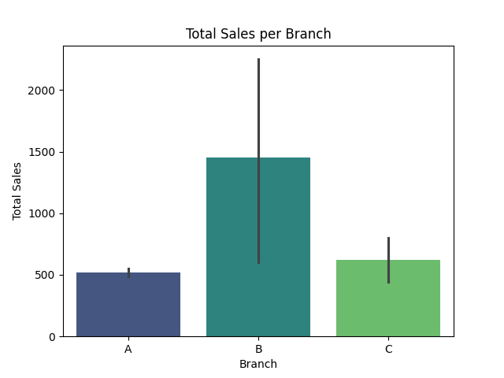
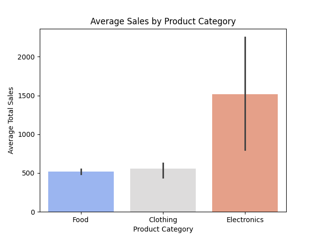
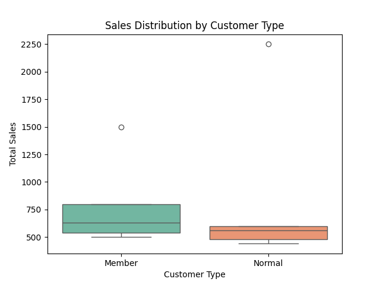

# 🏪 Supermarket Branch Sales Analysis using Python (Pandas, Seaborn & Matplotlib)

This project performs a branch-wise sales analysis for a supermarket using Python.  
It explores how product category, customer type, and branch location affect total sales — visualized using clear and insightful charts.


## 🧠 Project Objectives

✅ Analyze total sales for each branch  
✅ Compare sales performance across product categories  
✅ Understand how customer types (Member vs Normal) impact spending  
✅ Identify correlations between quantity, unit price, and total sales  


## 🗂️ Project Structure


📂 Supermarket-Branch-Sales-Analysis

┣ 📜 main.py                         # Python script for analysis

┣ 📊 total_sales_branch.png          # Bar plot – branch-wise sales

┣ 📊 sales_by_category.png           # Bar plot – category-wise average sales

┣ 📊 sales_by_customer_type.png      # Box plot – customer type comparison

┣ 📊 correlation_matrix.png          # Heatmap – correlation among numerical features

┗ 📘 README.md                       # Project documentation


## 🧩 Libraries Used

| Library        | Purpose                                     |
|----------------|---------------------------------------------|
| **pandas**     | For handling and creating structured data   |
| **seaborn**    | For beautiful and advanced plots            |
| **matplotlib** | For fine control and saving visual outputs  |

Install them using:
```bash
pip install pandas seaborn matplotlib


## 📊 Dataset Overview

| Column Name          | Description                         |
| -------------------- | ----------------------------------- |
| Invoice_ID           | Unique ID for each transaction      |
| Branch               | Supermarket branch (A, B, or C)     |
| Customer_Type        | Type of customer (Member / Normal)  |
| Product_Category     | Type of product purchased           |
| Quantity             | Number of items bought              |
| Unit_Price           | Price per item                      |
| Total_Sales          | Calculated as Quantity × Unit Price |

## 📊 Visualizations

### 🏬 Total Sales per Branch
Compares total sales across different supermarket branches.  


### 📦 Average Sales by Product Category
Shows which product categories generate the most revenue.  


### 👥 Sales by Customer Type
Compares how Members and Normal customers differ in spending.  



## 🚀 How to Run the Project

1. Clone this repository:

   
   git clone https://github.com/<your-username>/Supermarket-Branch-Sales-Analysis.git
   
2. Open the project folder in VS Code / Jupyter Notebook
3. Run:

   
   python main.py
4. Generated charts will appear in your folder.


## 💡 Key Insights

* Branch A performs consistently better than others.
* Food category drives the highest total sales volume.
* Members tend to make slightly higher purchases on average.
* Strong correlation between **Quantity** and **Total Sales** shows pricing consistency.

## 👩‍💻 Author

Isha Langeh
Aspiring Data Analyst | Python | Pandas | Seaborn | Matplotlib*
🌐 [GitHub Profile](https://github.com/ishalangehh-wq)
📧 [ishalangeh@gmail.com](mailto:ishalangeh@gmail.com)


      
